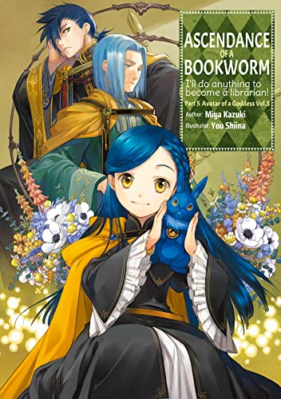
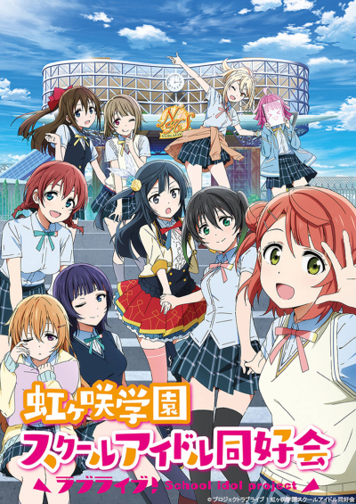
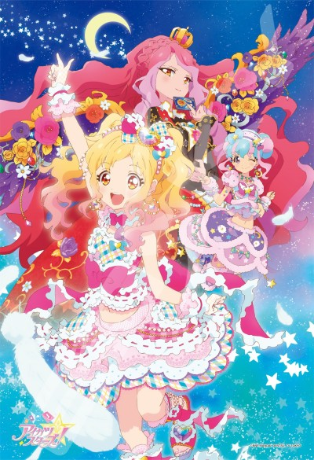

# Felipe Yousoro

    
<h1> 👋 𝑨𝒃𝒐𝒖𝒕 👋 </h1>

<table style="width: 100%">
<tr>

<td width="67.5%"> 
• I am Felipe Yousoro, a MSc student from the State University of Londrina with a liking for anime, light novels, gaming, and, of course, computer science   
• Currently researching about Data Governance and AI systems for Smart Cities    
• Working on developing solutions for enterprises and governments   
• I like systems integration, Data Science and some low-level stuff, such as emulators   
</td>

<td align="center">

</td>

</tr>
</table>

    
<h1>📈 𝑺𝒕𝒂𝒕𝒔 📊</h1>

<h1> 💻 𝑷𝒓𝒐𝒈𝒓𝒂𝒎𝒎𝒊𝒏𝒈 𝑳𝒂𝒏𝒈𝒖𝒂𝒈𝒆𝒔 🤖 </h1>

<h1>🛠️ 𝑻𝒐𝒐𝒍𝒔 🚀</h1>

<h1>🖥️ 𝑭𝒂𝒗𝒐𝒓𝒊𝒕𝒆 𝒂𝒏𝒊𝒎𝒆 𝒂𝒏𝒅 𝒏𝒐𝒗𝒆𝒍 𝒔𝒆𝒓𝒊𝒆𝒔 📚</h1>

<table>
    <tr>
    <th>Honzuki no Gekokujou</th>
    <th>Love Live!</th>
    <th>Aikatsu!</th>
    </tr>
    <tr>
    <td></td>
    <td></td>
    <td></td>
    </tr>
</table> 

<h1>🎮 𝑭𝒂𝒗𝒐𝒓𝒊𝒕𝒆 𝒈𝒂𝒎𝒆𝒔 🕹️</h1>

<table style="margin: 0 auto; width: 100%;">
    <tr>
    <th>Arknights</th>
    <th>Pokémon</th>
    <th>World of Warcraft</th>
    </tr>
    <tr>
    <td></td>
    <td></td>
    <td></td>
    </tr>
</table> 

